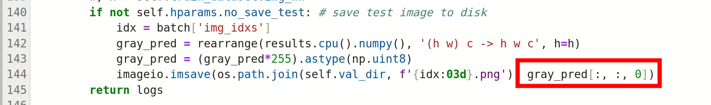
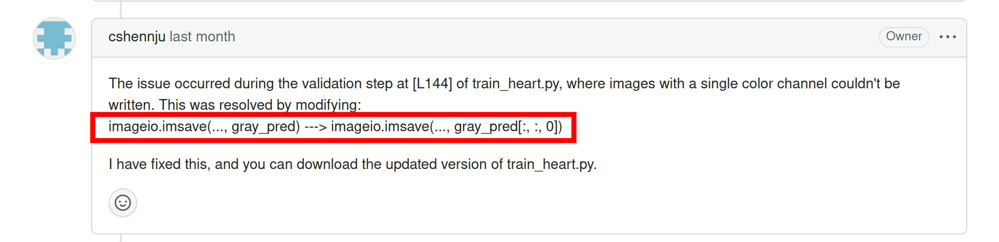
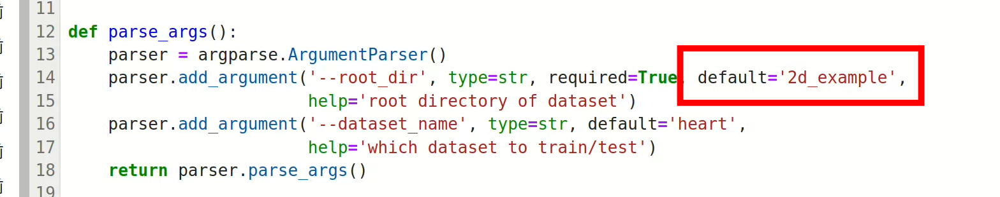
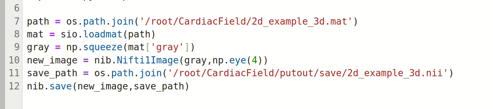

# CardiacField项目复现说明
## 环境配置
克隆项目 ``git clone https://github.com/cshennju/NeuralCMF.git``

anaconda配置下安装torch-scatter ``conda install pytorch-scatter -c pyg``，[其他安装环境](https://github.com/rusty1s/pytorch_scatter#installation)

安装tinycudann ``pip install git+https://github.com/NVlabs/tiny-cuda-nn/#subdirectory=bindings/torch``

安装apex
```
git clone https://github.com/NVIDIA/apex
cd apex
# if pip >= 23.1 (ref: https://pip.pypa.io/en/stable/news/#v23-1) which supports multiple `--config-settings` with the same key... 
pip install -v --disable-pip-version-check --no-cache-dir --no-build-isolation --config-settings "--build-option=--cpp_ext" --config-settings "--build-option=--cuda_ext" ./
# otherwise
pip install -v --disable-pip-version-check --no-cache-dir --no-build-isolation --global-option="--cpp_ext" --global-option="--cuda_ext" ./
```
> 注意，安装 apex 时间较长（大约30min）

安装成功以上插件之后，创建一个 conda 环境 ``conda create -name card``

执行 ``pip install -r requirements.txt`` 命令配置项目所需环境
## 源码改动部分
### 源码错误修正



将 ``train_heart.py`` 第144行的代码修改为如上图所示


### 路径修改
#### vis_3D.py
生成 ``.mat`` 文件时，注意调用正确的路径，这这里已经将默认文件夹修改


#### mat2nii.py
将 ``.mat`` 文件转化为 ``.nii``格式文件时，也要注意路径的正确调用，此处也以修改


## 增加代码说明
为了方便在 Blender 中查看3D心脏的全局面貌，这里增加如下代码，将 ``.mat`` 文件转化为 ``.obj`` 文件，导入 Blender 中即可查看

```py
import scipy.io
import numpy as np
from skimage.measure import marching_cubes
import trimesh

# 加载.mat文件
data = scipy.io.loadmat('2d_example_3d.mat')
gray = data['gray']

# 生成等值面（假设阈值为0）
vertices, faces, normals, _ = marching_cubes(gray, level=0)

# 创建网格并导出为.obj
mesh = trimesh.Trimesh(vertices=vertices, faces=faces)
mesh.export('output_2d3d.obj')
```

注意，在上述代码中，gray 是 ``.mat`` 文件中对应的非自动生成的键名，运行以下代码查看键名，就是对 gray 变量赋值的字符串

```py
import scipy.io

# 加载.mat文件
mat_data = scipy.io.loadmat('straus_3d.mat')

# 查看所有键（变量名）
print(mat_data.keys())

# 过滤掉MATLAB系统自动生成的键（如 __header__, __version__ 等）
keys = [key for key in mat_data.keys() if not key.startswith('__')]
print("用户定义的变量名:", keys)
```

## 项目执行流程说明
在配置好环境之后，依次执行下面的指令

激活 conda 环境

训练得到权重文件 ``python train_heart.py --root_dir './2d_example/' --exp_name '/2d_example/'`` ，ckpt 文件保存于 ckpts 文件夹中

执行 ``python vis_3D.py --root_dir '2d_example'`` 得到 ``.mat`` 文件

执行 ``python mat2nii.py`` 得到 ``.nii`` 文件，导入 3D Slicer 中查看，注意源代码中的文件路径调用

执行 ``seeKey.py`` 查看 ``.mat`` 的键名，注意源代码中的文件路径调用

执行 ``trans.py`` 将 ``.mat`` 文件变成 ``.obj``文件在 Blender 中查看，注意源代码中的文件路径调用

## 项目操作和结果展示视频
时间较长，4:46

<video controls src="演示视频v2.0.mp4" title="Title"></video>

同级PPT中是有部分截图也是对本项目的原理讲解和复现的展示
